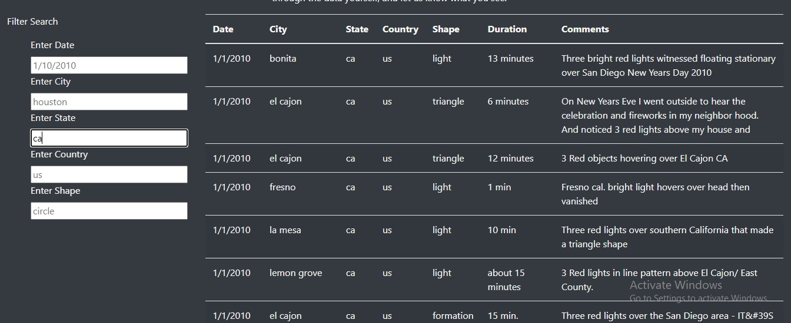

# UFOs

# Purpose
In the original UFO Sightings webpage, it was only possible to filter by date. However, there is much more information in the table in other others that it would be ideal to be able to filter even further. Filters would be added for city, state, country, and shape to allows users to further refine their search. 

# Results

A user can use the input fields on the left side to narrow down their search. If I am a resident in California, I could filter by filling in 'ca' in the "Enter State" field like so: 

A user then can see what findings within their state have been documented. If they are then interested in see what UFO sightings have occurred near them, they can refine the search further by typing in a city name in the "Enter City" field. For El Cajon, CA, it looks like such: 

And then finally, if a user wanted to confirm a suspicion that they say a UFO near them on a particular day, they can confound their story by searching for sightings for that day. Say this same user who lives near El Cajon, CA thought they saw a UFO on 1/4/2010 can search for that by entering that date in the "Enter Date" field:

# Summary

There is a drawback to this design since a user has to have an idea of what is in the table already to know what to search. For example, a user can start out with a date and then see the available options and then filter more. In other words, a user has to try a few filters to see if the data they want is even in the data. There are a few improvements that can be made to this design: 

(1) On the filters themselves, there can be a dropdown menu that lists all the possible options for that filter. That way, if someone starts typing and there is no value in that filter that matches it, it can say that value doesn't exist, and the user would know to try another value or another filter altogether. 

(2) It would be nice for the filters to accept more than one value. This way a user could possibly look at two locations near each other at one time. 

(3) Perhaps also add enough code to find the geolocation of each sighting and then be able to search by a location and radius to see sightings in one geographical location. 